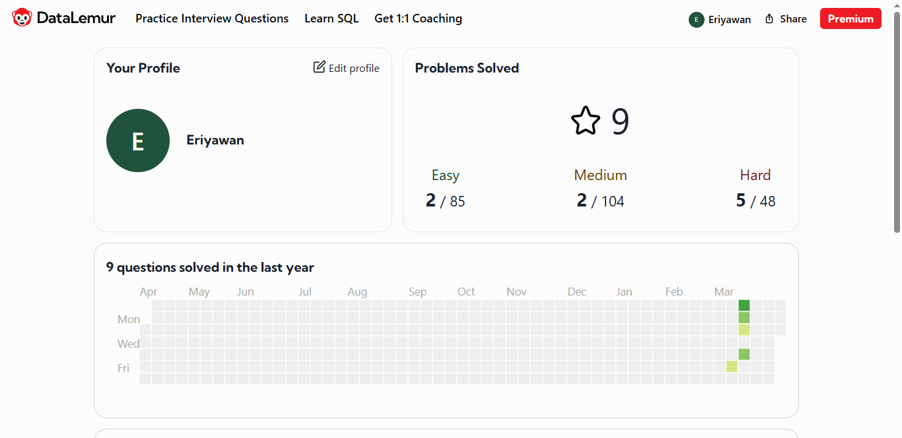

# 🚀 My SQL Portfolio
### DataLemur Challenge Solutions

This repository contains my personal solutions to various DataLemur challenges, implemented in **PostgreSQL**, and **Python**. It serves as a record of my problem-solving journey and a reference for different algorithmic approaches.

---

My profile link: [LinkedIn](https://id.linkedin.com/in/eriyawan) | [HackerRank](https://www.hackerrank.com/profile/erimilis) | [Leetcode](https://leetcode.com/u/erimilis)
---

## 🔴 Hard Challenges

### 1. Consecutive Filing Years
* **Topic:** Gaps and Islands, Data Analytics
* **Description:** Identify users who have completed document submissions for 3 consecutive years.
* **Approach:** CTE, LEAD(), LAG(), atau ROW_NUMBER(), date subtraction.
* **Links:** [Solustion Link](hard/consecutive-filing-years.md) | [Problem Link](https://datalemur.com/questions/consecutive-filing-years)

### 2. Repeated Payments
* **Topic:** Self-Join, Time-Series Analysis
* **Description:** Detects repeat transactions (same amount & merchant) within a time span of < 10 minutes.
* **Approach:** CTE, EXTRACT(EPOCH FROM ...) filtering.
* **Links:** [Solustion Link](hard/repeated-payments.md) | [Problem Link](https://datalemur.com/questions/repeated-payments)

### 3. Reactivated Users
* **Topic:** User Retention, Month-over-Month Analysis
* **Description:** Counts the number of users who returned to activity after a period of inactivity.
* **Approach:** CTE, LAG(), mapping.
* **Links:** [Solustion Link](hard/reactivated-users.md) | [Problem Link](https://datalemur.com/questions/reactivated-users){:target="_blank"}

### 4. Median Google Search Frequency
* **Topic:** Frequency, Statistic
* **Description:** Find median from a search frequency table.
* **Approach:** CTE, WINDOW.
* **Links:** [Solustion Link](hard/median-search-freq.md) | [Problem Link](https://datalemur.com/questions/median-search-freq){:target="_blank"}

### 5. Server Utilization Time
* **Topic:** Frequency, Statistic
* **Description:** Find server utilization from a status session table.
* **Approach:** CTE, WINDOW. EXTRACT(DAY, HOUR)
* **Links:** [Solustion Link](hard/total-utilization-time.md) | [Problem Link](https://datalemur.com/questions/total-utilization-time){:target="_blank"}

---

## 🟡 Medium Challenges

### 1. Highest Grossing Items
* **Topic:** Ranking, Aggregations
* **Description:** Find the 2 highest-grossing products per category in a given year..
* **Approach:** `RANK()` atau `DENSE_RANK()` di dalam CTE.
* **Links:** [Solustion Link](medium/sql-highest-grossing.md) | [Problem Link](https://datalemur.com/questions/sql-highest-grossing)

### 2. Top Three Salaries
* **Topic:** Window Functions
* **Description:** Displays the top 3 unique salaries per department.
* **Approach:** `DENSE_RANK()` untuk menangani nilai gaji yang identik.
* **Links:** [Solustion Link](medium/sql-top-three-salaries.md) | [Problem Link](https://datalemur.com/questions/sql-top-three-salaries)

---

## 🟢 Easy Challenges

### 1. Histogram of Tweets
* **Topic:** Basic Aggregation
* **Description:** Create a distribution of the number of tweets sent by users in 2022.
* **Approach:** Double `GROUP BY` (Nested Aggregation).
* **Links:** [Solustion Link](easy/sql-histogram-tweets) | [Problem Link](https://datalemur.com/questions/sql-histogram-tweets)

### 2. Contains Duplicates (Python)
* **Topic:** Array & Hash Set Logic
* **Description:** Checks whether there are duplicate values ​​in the list.
* **Approach:** Comparing list length and set length.
* **Links:** [Solustion Link](easy/python-contains-duplicate) | [Problem Link](https://datalemur.com/questions/python-contains-duplicate)

---

## 🛠️ Tech Stack
* **SQL:** PostgreSQL (Standard Environment)
* **Python:** Basic Data Structures
* **Skills:** Window Functions, CTEs, Time-Series Analysis, Query Optimization.

